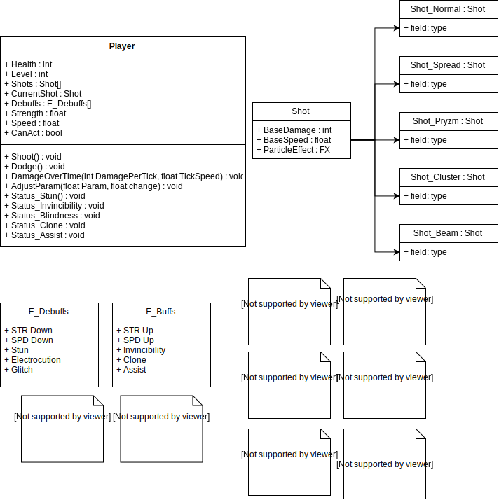

# BlastR
A high energy arcade shooter!

## Player
The Player takes control of a Flight Unit, capable of shooting simple projectiles called "shots". The speed and strength of these shots scale to the player's level - upgrading every 50 player levels, or when an upgrade pickup is acquired

### Shot Types, Buffs and Debuffs

#### Shots
#####  Normal Shot 

Normal Shots are standard fare - shooting in a straight line, with upgrades increasing their speed.

##### Spread Shot 

Spread Shots shoot in an arc, and do less damage than the standard Normal Shot - but can hit multiple enemies at once.

Spread Shot upgrades increase the number of bullets fired per shot.

##### Cluster Shot 

Cluster shots fragment after being shot, with fragments dealing 1/10th of the shot's actual damage to any enemies they hit.

Cluster shot upgrades increase the number of fragments.

##### Beam Shot 

Beam shots fire a continuous laser that deals low damage, but can hit multiple enemies at once.

Beam shot upgrades increase the beam's width.

##### Pryzm Shot 

Pryzm Shots create a temporary damage over time field on the screen, dealing 1/20th base damage to any overlapping enemies per tick.

Pryzm Shot upgrades decrease the tick interval of the field.
