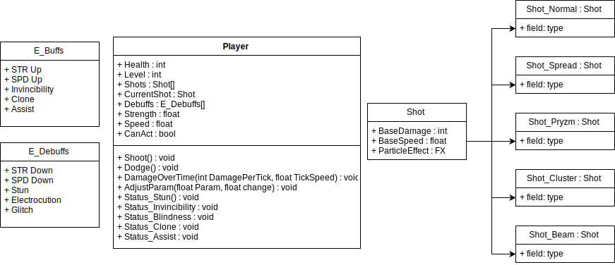

# BlastR
A high energy arcade shooter!

## Player
The Player takes control of a Flight Unit, capable of shooting simple projectiles called "shots". The speed and strength of these shots scale to the player's level - upgrading every 50 player levels, or when an upgrade pickup is acquired

### Shot Types, Buffs and Debuffs

#### Shots

All Shots contain parameters for their:
  - level
    - The level of the shot itself. Is actually contained within the GameController object, but is replicated to each instance of the shot.
    - Is an integer ranging between 1 and 20 (XX)
    - 1-9 is displayed as just the number, the 10's column is displayed as an X (i.e 16 = X6)
  - base damage
    - The scalable damage of the shot. This is used in Damage calculation, which also takes the shot's level into account.
  - base speed
    - The speed at which the shot travels. Expressed as an impulse exerted on the shot's rigidbody.

#####  Normal Shot 

Normal Shots are standard fare - shooting in a straight line, with upgrades increasing their speed.

##### Spread Shot 

Spread Shots shoot in an arc, and do less damage than the standard Normal Shot - but can hit multiple enemies at once.

Spread Shot upgrades increase the number of bullets fired per shot.

##### Cluster Shot 

Cluster shots fragment on impact, with fragments dealing 1/10th of the shot's damage to any enemies they hit.

Cluster shot upgrades increase the number of fragments released.

##### Beam Shot 

Beam shots fire a continuous laser that deals low damage, but can hit multiple enemies at once.

Beam shot upgrades increase the beam's width.

##### Pryzm Shot 

Pryzm Shots create a temporary damage over time field on the screen, dealing 1/20th base damage to any overlapping enemies per tick.

Pryzm Shot upgrades decrease the tick interval of the field.

#### Buffs
There are a number of Buffs which the player can acquire from Pickups in the stage.
- Speed Up
  - Increases the player's Speed value by 1.
- Strength Up
  - Increases the player's Strength value by 1.
- Invincibility
  - Allows the player to be invincible for a duration of time.
- Clone
  - Creates a mirrored clone of the player, which repeats the same inputs.
- Assist
  - Summons an AI fighter to assist you through the level. Dissipates after a certain amount of time.

#### Debuffs
However, some pickups and certain enemies can inflict Debuffs to the player as well...
- Speed Down
  - Decreases the player's Speed value by 1.
- Strength Down
  - Decreases the player's Strength value by 1.
- Stun
  - Prevents the player from executing actions for a duration of time
- Electrocution
  - Deals constant Damage Over Time to the player over a duration of time.
- Glitch
  - Disrupts the player's HUD and Field of View, and adds a Glitch filter effect to the screen.

### User Interface

BlastR's in-game UI displays information the player will constantly need to keep track of in the bottom bar:
- Health
- Current Shot Type
- Buffs & Debuffs

In addition to this, the Score is always visible in the top right.

Other information, like stats or level progress, can be found in the sidebar - which can be hidden at the user's discretion.
